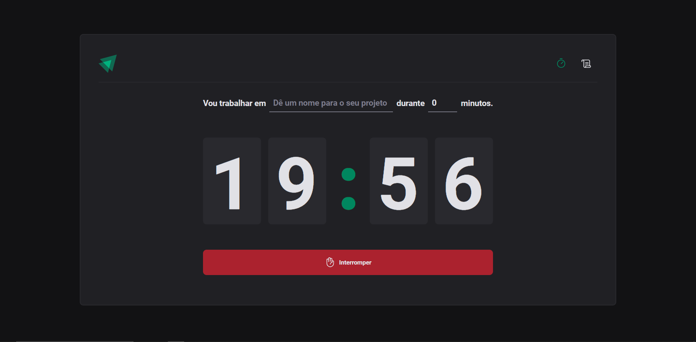
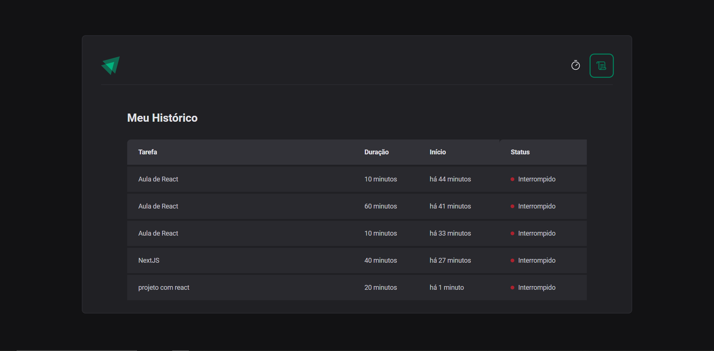

<h1 align="center">Ignite Timer</h1>

Projeto proposto no curso Ignite da Rocketseat, no qual foi desenvolvido um timer para o gerenciamento de tarefas

 

  

  

## Tecnologias

Esse projeto foi desenvolvido com as seguintes tecnologias:

- React
- Styled Components
- TypeScript
- Vite
- DateFNS
- Git e Github
- Immer
- Zod
- React-Hook-Form